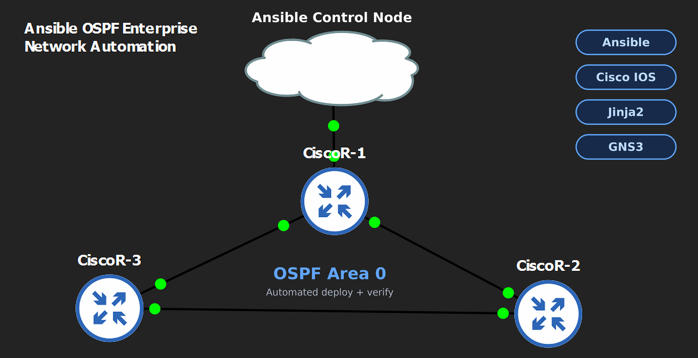

# Ansible OSPF Automation

Automating OSPF configuration on Cisco routers using Ansible roles, host variables and Jinja2 templates.



This project was built as a hands-on network automation exercise to practice moving from manually configuring network devices to managing their configuration with code.

## Project overview

The goal is to automate the configuration of OSPF across multiple Cisco routers. The playbook handles:

- Hostname configuration
- Interface configuration and IP addressing
- OSPF interface configuration
- OSPF router IDs and areas
- Passive interfaces
- Configuration templating with Jinja2
- Ansible role structure
- Idempotent configuration

The lab was built and tested in GNS3.

## Technologies used

Ansible, Cisco IOS, Jinja2, YAML, GNS3, Python

## Lab topology

Three Cisco routers (R1, R2 and R3) connected in a triangle, all running OSPF. An Ansible control node connects to R1 for management.

## Project structure

```
ansible-ospf-automation/
├── ansible.cfg
├── requirements.yml
├── inventory/
│   ├── group_vars/
│   │   └── routers.yml
│   ├── host_vars/
│   │   ├── R1.yaml
│   │   ├── R2.yaml
│   │   └── R3.yaml
│   └── hosts.ini
├── playbooks/
│   ├── deploy.yaml
│   └── verify.yaml
└── roles/
    └── ospf_deploy/
        ├── tasks/
        │   └── main.yaml
        └── templates/
            └── ospf_config.j2
```

## How it works

### 1. Inventory

The inventory (`inventory/hosts.ini`) lists the routers Ansible manages: R1, R2 and R3.

### 2. Variables

Router-specific values live in `host_vars/` instead of being hard-coded in the template. Example:

```yaml
ospf_interface: GigabitEthernet0/2
ip_address: 11.0.0.1
subnet_mask: 255.255.255.0
ospf_process: 1
ospf_area: 0
ospf_router_id: 1.1.1.1
```

### 3. Jinja2 template

The configuration is generated from one template, so the same file works for every router with different variables.

```jinja
hostname {{ inventory_hostname }}

interface {{ ospf_interface }}
 ip address {{ ip_address }} {{ subnet_mask }}
 ip ospf {{ ospf_process }} area {{ ospf_area }}

router ospf {{ ospf_process }}
 router-id {{ ospf_router_id }}

 passive-interface {{ intf }}

```

### 4. Ansible role

The OSPF configuration is organized into the `ospf_deploy` role, which applies the rendered configuration to the routers.

### 5. Idempotency

After the configuration is applied, running the playbook again should not keep reporting changes if the devices already match the intended configuration:

```
R1  changed=0
R2  changed=0
R3  changed=0
```

This was one of the harder parts of the project, because the playbook initially kept reporting changes on every run.

## Running the project

### Prerequisites

- Python 3
- Ansible
- GNS3 (or compatible Cisco IOS devices)
- SSH connectivity to the routers
- The `cisco.ios` Ansible collection

### 1. Install Ansible

For example, on Ubuntu/Debian:

```bash
sudo apt update
sudo apt install ansible
ansible --version
```

### 2. Clone the repository

```bash
git clone https://github.com/gbakinde-byte/network-automation.git
cd network-automation/ansible-ospf-automation
```

### 3. Install the required collection

```bash
ansible-galaxy collection install -r requirements.yml
```

### 4. Configure the inventory

Update `inventory/hosts.ini` and the files in `host_vars/` with the IP addresses and connection details for your routers. Do not commit real passwords (see the security note below).

### 5. Test connectivity

```bash
ansible routers -m cisco.ios.ios_command -a "commands='show version'"
```

### 6. Run the playbook

```bash
ansible-playbook playbooks/deploy.yaml
```

### 7. Verify

Run `playbooks/verify.yaml`, or check directly on the routers:

```
show ip ospf neighbor
show ip ospf interface
show ip ospf
show ip route ospf
show running-config
```

The expected result is that the routers form OSPF neighbor relationships and learn OSPF routes.

## Sample output

[Add a screenshot of a successful deploy run and the `PLAY RECAP`, plus `show ip ospf neighbor` from one router.]

## What I learned

- **Ansible roles:** organizing automation into reusable roles instead of one large playbook.
- **Jinja2:** using variables and loops to generate device-specific configuration from a common template.
- **Network automation:** moving from typing Cisco IOS commands to describing the desired configuration and letting Ansible apply it.
- **Idempotency:** a successful run is not enough, a good workflow should also behave predictably when run repeatedly.
- **Troubleshooting:** working through configuration differences, Ansible behavior and connectivity issues in the GNS3 lab.

## Future improvements

- Automate more OSPF parameters
- Support multiple network vendors
- Add configuration validation and automated pre-checks and post-checks
- Add pyATS verification
- Add CI/CD for the Ansible project
- Expand the topology
- Automate network documentation

## Security note

This is a lab project. Do not commit real credentials. Use Ansible Vault or environment variables for passwords, and keep secrets out of the repository.

## Status

Work in progress. The project is functional, and I plan to keep improving the automation, verification and multi-vendor support.

## Author

Goodness Bakinde, early-career Network Engineer focused on network automation.
[LinkedIn](https://www.linkedin.com/in/goodness-bakinde/)
